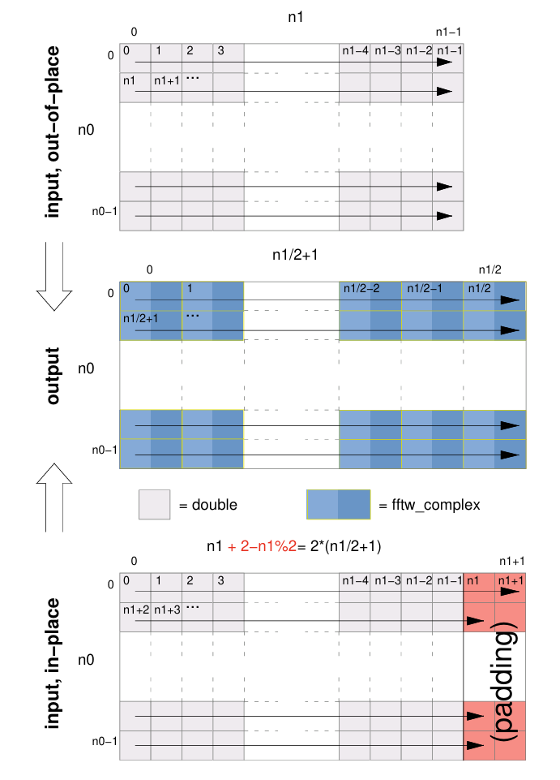

# Answer the questions
- [x] true Perform a FFT c2c (complex-to-complex) and call this new matrix C
- [x] Reconstruct matrix A by inverse_c2c Fourier transform, what is the mean and median absolute and relative error? [report values with square root of the mean/median square errors]
  - see output below
- [x] Perform a FFT r2c (real-to-complex) and call this new matrix R
- [x] Reconstruct matrix A by inverse_c2r Fourier transform, what is the mean and median absolute and relative error? [report values with square root of the mean/median square errors]
  - see output below
- [x] Are you reaching machine precision in point 2 and 4? If not, try to comment on why
  - Very close to machine precision. But the relative errors are slightly larger, I guess this is because the relative error is more sensitive to small values.
- [x] What is the value of C[0,0] or R[0,0]? Can you guess its meaning? 
  - I asked ChatGPT for C[0,0] and R[0,0], it said: "C[0,0] and R[0,0] represent the DC component (zero frequency component) or the sum of all elements in the original". I cross-checked it by my outputs, indeed, it is the sum of all elements in the original matrix A.
- [x] [BONUS] Reduce the dimension of A to 6x6. Try to obtain matrix C from matrix R.
  - At the begging, I was printing R with a wrong format, I didn't realize what wiill happen for a out-place transform and the column that is out of (N/2+1) does not exist. I tried to understand what is **“In many practical applications, the input data in[i] are purely real numbers, in which case the DFToutputsatisfies the “Hermitian” redundancy: out[i] is the conjugate of out[n-i].”**. At the end I found that the index is countiued with (N/2+1) columns per row. Then I chekcked the outputs of R and C, and I finally figured out how to obtain C from R. See the code below.
  - 
# output
## Errors
```bash
    Filling matrix with random complex numbers...
    Sum of real parts: -2070.57
    Sum of imaginary parts: 0
    Average value of real part: -0.000517641
    Average value of imaginary part: 0
    Mean Absolute Error: 4.52494e-16
    Median Absolute Error: 4.38029e-16
    Mean Relative Error: 4.86212e-15
    Median Relative Error: 6.21119e-16
    Performing real-to-complex and complex-to-real FFT...
    Mean Absolute Error: 3.89541e-16
    Median Absolute Error: 3.33067e-16
    Mean Relative Error: 4.25088e-15
    Median Relative Error: 4.8937e-16
    Machine precision: 
    float epsilon: 1.19209e-07
    double epsilon: 2.22045e-16
    long double epsilon: 1.0842e-19
```
## matrices
- input_matrix.txt
```text
   -0.031106 +     0.000000i		   -0.868043 +     0.000000i		   -1.166779 +     0.000000i		    0.901862 +     0.000000i		   -0.239172 +     0.000000i		   -1.262917 +     0.000000i		
   -0.719700 +     0.000000i		   -0.360906 +     0.000000i		   -2.317287 +     0.000000i		   -0.085956 +     0.000000i		   -0.007821 +     0.000000i		   -0.461713 +     0.000000i		
    0.059384 +     0.000000i		    1.069893 +     0.000000i		   -0.619946 +     0.000000i		   -2.165800 +     0.000000i		    1.109278 +     0.000000i		   -0.525288 +     0.000000i		
    1.308681 +     0.000000i		   -0.730271 +     0.000000i		    0.032430 +     0.000000i		    1.613877 +     0.000000i		    0.088562 +     0.000000i		   -0.247802 +     0.000000i		
    0.300286 +     0.000000i		   -0.913856 +     0.000000i		    0.567237 +     0.000000i		   -0.183961 +     0.000000i		    0.261686 +     0.000000i		    1.513029 +     0.000000i		
    0.166943 +     0.000000i		   -0.547698 +     0.000000i		    0.296497 +     0.000000i		    0.108798 +     0.000000i		    1.027204 +     0.000000i		    1.960823 +     0.000000i		
```
- output_matrix.txt
```text
   -1.069554 +     0.000000i		    0.692349 +     7.599025i		    2.444738 +    -1.836469i		    1.302308 +     0.000000i		    2.444738 +     1.836469i		    0.692349 +    -7.599025i		
   -5.438012 +     8.298992i		   -3.905055 +    -0.266481i		   -6.947262 +    -1.389346i		   -3.527537 +     0.562088i		    8.420130 +     1.674758i		    0.621732 +    -3.021111i		
   -0.366241 +     3.766391i		   -2.853936 +    -0.789377i		    9.164661 +    -3.611733i		    0.227713 +     3.083803i		    6.361531 +    -3.119954i		   -4.289017 +     4.026242i		
   -3.318876 +     0.000000i		    1.961090 +    -2.769876i		   -3.608530 +    -1.479454i		    4.049591 +     0.000000i		   -3.608530 +     1.479454i		    1.961090 +     2.769876i		
   -0.366241 +    -3.766391i		   -4.289017 +    -4.026242i		    6.361531 +     3.119954i		    0.227713 +    -3.083803i		    9.164661 +     3.611733i		   -2.853936 +     0.789377i		
   -5.438012 +    -8.298992i		    0.621732 +     3.021111i		    8.420130 +    -1.674758i		   -3.527537 +    -0.562088i		   -6.947262 +     1.389346i		   -3.905055 +     0.266481i		
```
- inverse_output_matrix.txt
```text
   -0.031106 +     0.000000i		   -0.868043 +     0.000000i		   -1.166779 +     0.000000i		    0.901862 +     0.000000i		   -0.239172 +     0.000000i		   -1.262917 +     0.000000i		
   -0.719700 +     0.000000i		   -0.360906 +     0.000000i		   -2.317287 +     0.000000i		   -0.085956 +     0.000000i		   -0.007821 +     0.000000i		   -0.461713 +     0.000000i		
    0.059384 +     0.000000i		    1.069893 +     0.000000i		   -0.619946 +     0.000000i		   -2.165800 +     0.000000i		    1.109278 +     0.000000i		   -0.525288 +     0.000000i		
    1.308681 +     0.000000i		   -0.730271 +     0.000000i		    0.032430 +     0.000000i		    1.613877 +     0.000000i		    0.088562 +     0.000000i		   -0.247802 +     0.000000i		
    0.300286 +     0.000000i		   -0.913856 +     0.000000i		    0.567237 +     0.000000i		   -0.183961 +     0.000000i		    0.261686 +     0.000000i		    1.513029 +     0.000000i		
    0.166943 +     0.000000i		   -0.547698 +     0.000000i		    0.296497 +     0.000000i		    0.108798 +     0.000000i		    1.027204 +     0.000000i		    1.960823 +     0.000000i		
```
- input_matrix_r2c.txt
```text
   -0.031106		   -0.868043		   -1.166779		    0.901862		   -0.239172		   -1.262917		
   -0.719700		   -0.360906		   -2.317287		   -0.085956		   -0.007821		   -0.461713		
    0.059384		    1.069893		   -0.619946		   -2.165800		    1.109278		   -0.525288		
    1.308681		   -0.730271		    0.032430		    1.613877		    0.088562		   -0.247802		
    0.300286		   -0.913856		    0.567237		   -0.183961		    0.261686		    1.513029		
    0.166943		   -0.547698		    0.296497		    0.108798		    1.027204		    1.960823				
```
- output_matrix_r2c.txt
```text
   -1.069554 +     0.000000i		    0.692349 +     7.599025i		    2.444738 +    -1.836469i		    1.302308 +     0.000000i		    0.000000 +     0.000000i		    0.000000 +     0.000000i		
   -5.438012 +     8.298992i		   -3.905055 +    -0.266481i		   -6.947262 +    -1.389346i		   -3.527537 +     0.562088i		    0.000000 +     0.000000i		    0.000000 +     0.000000i		
   -0.366241 +     3.766391i		   -2.853936 +    -0.789377i		    9.164661 +    -3.611733i		    0.227713 +     3.083803i		    0.000000 +     0.000000i		    0.000000 +     0.000000i		
   -3.318876 +     0.000000i		    1.961090 +    -2.769876i		   -3.608530 +    -1.479454i		    4.049591 +     0.000000i		    0.000000 +     0.000000i		    0.000000 +     0.000000i		
   -0.366241 +    -3.766391i		   -4.289017 +    -4.026242i		    6.361531 +     3.119954i		    0.227713 +    -3.083803i		    0.000000 +     0.000000i		    0.000000 +     0.000000i		
   -5.438012 +    -8.298992i		    0.621732 +     3.021111i		    8.420130 +    -1.674758i		   -3.527537 +    -0.562088i		    0.000000 +     0.000000i		    0.000000 +     0.000000i			
```
- inverse_output_matrix_r2c.txt
```text
   -0.031106		   -0.868043		   -1.166779		    0.901862		   -0.239172		   -1.262917		
   -0.719700		   -0.360906		   -2.317287		   -0.085956		   -0.007821		   -0.461713		
    0.059384		    1.069893		   -0.619946		   -2.165800		    1.109278		   -0.525288		
    1.308681		   -0.730271		    0.032430		    1.613877		    0.088562		   -0.247802		
    0.300286		   -0.913856		    0.567237		   -0.183961		    0.261686		    1.513029		
    0.166943		   -0.547698		    0.296497		    0.108798		    1.027204		    1.960823			
```
- output_matrix_r2c_conj.txt
```text
   -1.069554 +     0.000000i		    0.692349 +     7.599025i		    2.444738 +    -1.836469i		    1.302308 +     0.000000i		    2.444738 +     1.836469i		    0.692349 +    -7.599025i		
   -5.438012 +     8.298992i		   -3.905055 +    -0.266481i		   -6.947262 +    -1.389346i		   -3.527537 +     0.562088i		   -6.947262 +     1.389346i		   -3.905055 +     0.266481i		
   -0.366241 +     3.766391i		   -2.853936 +    -0.789377i		    9.164661 +    -3.611733i		    0.227713 +     3.083803i		    9.164661 +     3.611733i		   -2.853936 +     0.789377i		
   -3.318876 +     0.000000i		    1.961090 +    -2.769876i		   -3.608530 +    -1.479454i		    4.049591 +     0.000000i		   -3.608530 +     1.479454i		    1.961090 +     2.769876i		
   -0.366241 +    -3.766391i		   -4.289017 +    -4.026242i		    6.361531 +     3.119954i		    0.227713 +    -3.083803i		    6.361531 +    -3.119954i		   -4.289017 +     4.026242i		
   -5.438012 +    -8.298992i		    0.621732 +     3.021111i		    8.420130 +    -1.674758i		   -3.527537 +    -0.562088i		    8.420130 +     1.674758i		    0.621732 +    -3.021111i		
```


# Source Code

## compiled language
C++ (FFTW3)
```C++
#include <random>
#include <complex>
#include <vector>
#include <iostream>
#include <fftw3.h>
#include <algorithm>

using namespace std;

/// @brief Save matrix to file
/// @tparam T data type (fftw_complex or double)
/// @param filename name of the file
/// @param matrix pointer to the matrix data
/// @param N size of the matrix (N x N)
/// @param scale scaling factor for the output values
template<typename T>
void save_matrix_to_file(const char* filename, T* matrix, int N, double scale = 1.0, bool doR2C = false) {
    FILE* fp = fopen(filename, "w");
    for (int i = 0; i < N; i++) {
        for (int j = 0; j < N; j++) {
            int idx = i * N + j;
            if constexpr (is_same<T, fftw_complex>::value) {
                if (doR2C) {
                    if (j >= N / 2 + 1) {
                        fprintf(fp, "% 12.6f + % 12.6fi\t\t", 0.0, 0.0); // zero padding for real-to-complex FFT output
                    } else {
                        fprintf(fp, "% 12.6f + % 12.6fi\t\t", matrix[idx - (i * (N / 2 - 1))][0] * scale, matrix[idx - (i * (N / 2 - 1))][1] * scale);
                    }
                } else {
                    fprintf(fp, "% 12.6f + % 12.6fi\t\t", matrix[idx][0] * scale, matrix[idx][1] * scale);
                }
            } else if constexpr (is_same<T, double>::value) {
                fprintf(fp, "% 12.6f\t\t", matrix[idx] * scale);
            }
        }
        fprintf(fp, "\n");
    }
    fclose(fp);
}

// void save_matrix_to_file(const char* filename, fftw_complex* matrix, int N, double scale = 1.0) {
//     FILE* fp = fopen(filename, "w");
//     for (int i = 0; i < N; i++) {
//         for (int j = 0; j < N; j++) {
//             int idx = i * N + j;
//             fprintf(fp, "% 12.6f + % 12.6fi\t\t", matrix[idx][0] * scale, matrix[idx][1] * scale);
//         }
//         fprintf(fp, "\n");
//     }
//     fclose(fp);
// }

template<typename T>
void mean_med_abs_rel_err(T* original, T* reconstructed, int N) {
    double mean_abs_err = 0.0;
    double mean_rel_err = 0.0;
    double med_abs_err = 0.0;
    double med_rel_err = 0.0;
    vector<double> abs_errors;
    vector<double> rel_errors;
    for (int i = 0; i < N; i++) {
        for (int j = 0; j < N; j++) {
            int idx = i * N + j;
            if constexpr (is_same<T, fftw_complex>::value) {
                double orig_real = original[idx][0];
                double orig_imag = original[idx][1];
                double orig_magnitude = sqrt(pow(orig_real, 2) + pow(orig_imag, 2));
                double rec_real = reconstructed[idx][0] / (N * N);
                double rec_imag = reconstructed[idx][1] / (N * N);
                double abs_err = sqrt(pow(orig_real - rec_real, 2) + pow(orig_imag - rec_imag, 2));
                double rel_err = (orig_magnitude != 0.0) ? (abs_err / orig_magnitude) : 0.0;
                mean_abs_err += abs_err;
                mean_rel_err += rel_err;
                abs_errors.push_back(abs_err);
                rel_errors.push_back(rel_err);
            } else {
                double orig_value = original[idx];
                double rec_value = reconstructed[idx] / (N * N);
                double abs_err = fabs(orig_value - rec_value);
                double rel_err = (orig_value != 0.0) ? (abs_err / fabs(orig_value)) : 0.0;
                mean_abs_err += abs_err;
                mean_rel_err += rel_err;
                abs_errors.push_back(abs_err);
                rel_errors.push_back(rel_err);
            }
        }
    }
    mean_abs_err /= (N * N);
    mean_rel_err /= (N * N);
    nth_element(abs_errors.begin(), abs_errors.begin() + (N * N) / 2, abs_errors.end());
    med_abs_err = abs_errors[(N * N) / 2];
    nth_element(rel_errors.begin(), rel_errors.begin() + (N * N) / 2, rel_errors.end());
    med_rel_err = rel_errors[(N * N) / 2];
    cout << "Mean Absolute Error: " << mean_abs_err << endl;
    cout << "Median Absolute Error: " << med_abs_err << endl;
    cout << "Mean Relative Error: " << mean_rel_err << endl;
    cout << "Median Relative Error: " << med_rel_err << endl;
}

// void mean_med_abs_rel_err(fftw_complex* original, fftw_complex* reconstructed, int N) {
//     double mean_abs_err = 0.0;
//     double mean_rel_err = 0.0;
//     double med_abs_err = 0.0;
//     double med_rel_err = 0.0;
//     vector<vector<double>> errors;
//     for (int i = 0; i < N; i++) {
//         for (int j = 0; j < N; j++) {
//             int idx = i * N + j;
//             double orig_real = original[idx][0];
//             double orig_imag = original[idx][1];
//             double orig_magnitude = sqrt(pow(orig_real, 2) + pow(orig_imag, 2));
//             double rec_real = reconstructed[idx][0] / (N * N);
//             double rec_imag = reconstructed[idx][1] / (N * N);

//             double abs_err = sqrt(pow(orig_real - rec_real, 2) + pow(orig_imag - rec_imag, 2));
//             double rel_err = (orig_magnitude != 0.0) ? (abs_err / orig_magnitude) : 0.0;
//             mean_abs_err += abs_err;
//             mean_rel_err += rel_err;
//             errors.push_back({abs_err, rel_err});
//         }
//     }
//     mean_abs_err /= (N * N);
//     mean_rel_err /= (N * N);
//     nth_element(errors[0].begin(), errors[0].begin() + N / 2, errors[0].end());
//     med_abs_err = errors[0][N / 2];
//     nth_element(errors[1].begin(), errors[1].begin() + N / 2, errors[1].end());
//     med_rel_err = errors[1][N / 2];
//     cout << "Mean Absolute Error: " << mean_abs_err << endl;
//     cout << "Median Absolute Error: " << med_abs_err << endl;
//     cout << "Mean Relative Error: " << mean_rel_err << endl;
//     cout << "Median Relative Error: " << med_rel_err << endl;

// }

int main() {
    // random number generator
    random_device rd;
    mt19937 r_generator(rd()); // seed the generator
    normal_distribution<double> normal_dist(0.0, 1.0); // mean 0, stddev 1

    int N = 6; // size of the array
    fftw_complex *matrix_A, *matrix_C, *matrix_inverseA;
    matrix_A = (fftw_complex*) fftw_malloc(sizeof(fftw_complex) * N * N);
    matrix_inverseA = (fftw_complex*) fftw_malloc(sizeof(fftw_complex) * N * N);
    matrix_C = (fftw_complex*) fftw_malloc(sizeof(fftw_complex) * N * N);

    cout << "Filling matrix with random complex numbers..." << endl;
    // Fill matrix_A with random complex numbers
    double sum_real = 0.0;
    double sum_imag = 0.0;
    for (int i = 0; i < N * N; ++i) {
        matrix_A[i][0] = normal_dist(r_generator); // real part
        matrix_A[i][1] = 0.; // imaginary part
        sum_real += matrix_A[i][0];
        sum_imag += matrix_A[i][1];
    }
    cout << "Sum of real parts: " << sum_real << endl;
    cout << "Sum of imaginary parts: " << sum_imag << endl;
    cout << "Average value of real part: " << sum_real / (N * N) << endl;
    cout << "Average value of imaginary part: " << sum_imag / (N * N) << endl;

    save_matrix_to_file<fftw_complex>("input_matrix.txt", matrix_A, N);

    // Create FFTW plan for forward transform
    fftw_plan forward;
    forward = fftw_plan_dft_2d(N, N, matrix_A, matrix_C, FFTW_FORWARD, FFTW_ESTIMATE);

    // Execute the FFT
    fftw_execute(forward);

    save_matrix_to_file<fftw_complex>("output_matrix.txt", matrix_C, N);

    fftw_plan backward;
    backward = fftw_plan_dft_2d(N, N, matrix_C, matrix_inverseA, FFTW_BACKWARD, FFTW_ESTIMATE);

    // Execute the inverse FFT
    fftw_execute(backward);

    save_matrix_to_file<fftw_complex>("inverse_output_matrix.txt", matrix_inverseA, N, 1.0 / (N * N));

    // Calculate and print mean and median absolute and relative errors
    mean_med_abs_rel_err<fftw_complex>(matrix_A, matrix_inverseA, N);

    ////////////////////////////////////////////////////////////////////////////////////////////////
    cout << "Performing real-to-complex and complex-to-real FFT..." << endl;
    // type conversion: complex to real
    double* matrix_realA = (double*) fftw_alloc_real(N * N);
    for (int i = 0; i < N * N; ++i) {
        matrix_realA[i] = matrix_A[i][0]; // take only the real part
    }
    save_matrix_to_file<double>("input_matrix_r2c.txt", matrix_realA, N);

    fftw_complex* matrix_R = (fftw_complex*) fftw_alloc_complex(N * (N / 2 + 1));
    double* matrix_inverseR = (double*) fftw_alloc_real(N * N);
    fftw_plan r2c_forward, c2r_backward;
    
    r2c_forward = fftw_plan_dft_r2c_2d(N, N, matrix_realA, matrix_R, FFTW_ESTIMATE);
    fftw_execute(r2c_forward);
    save_matrix_to_file<fftw_complex>("output_matrix_r2c.txt", matrix_R, N, 1.0, true);

    /////////////////////////////////////////////////////////////////////////////////////////////////
    // obtain matrix C from matrix R
    vector<fftw_complex> matrix_C_from_R(N * N);
    for (int i = 0; i < N; ++i) {
        for (int j = 0; j < N / 2 + 1; ++j) {
            int idx_R = i * (N / 2 + 1) + j;
            int idx_C = i * N + j;
            matrix_C_from_R[idx_C][0] = matrix_R[idx_R][0];
            matrix_C_from_R[idx_C][1] = matrix_R[idx_R][1];
            cout << "i: " << i << ", j: " << j << ", idx_C: " << idx_C << ", idx_R: " << idx_R << endl;
            if (j != 0 && j != N / 2) { // fill the conjugate symmetric part
                int idx_C_conj = i * N + (N - j);
                cout << "i: " << i << ", j: " << j << ", idx_C_conj: " << idx_C_conj << ", idx_R: " << idx_R << endl;
                matrix_C_from_R[idx_C_conj][0] = matrix_R[idx_R][0];
                matrix_C_from_R[idx_C_conj][1] = -matrix_R[idx_R][1];
            }
        }
    }
    save_matrix_to_file<fftw_complex>("output_matrix_r2c_conj.txt", matrix_C_from_R.data(), N);
    /////////////////////////////////////////////////////////////////////////////////////////////////

    c2r_backward = fftw_plan_dft_c2r_2d(N, N, matrix_R, matrix_inverseR, FFTW_ESTIMATE);
    fftw_execute(c2r_backward);
    save_matrix_to_file<double>("inverse_output_matrix_r2c.txt", matrix_inverseR, N, 1.0 / (N * N));

    mean_med_abs_rel_err<double>(matrix_realA, matrix_inverseR, N);

    // Cleanup
    fftw_destroy_plan(forward);
    fftw_destroy_plan(backward);
    fftw_destroy_plan(r2c_forward);
    fftw_destroy_plan(c2r_backward);
    fftw_free(matrix_A);
    fftw_free(matrix_C);
    fftw_free(matrix_inverseA);
    fftw_free(matrix_R);
    fftw_free(matrix_inverseR);
    fftw_free(matrix_realA);

    fftw_cleanup();

    cout << "Machine precision: " << endl;
    cout << "float epsilon: " << numeric_limits<float>::epsilon() << endl;
    cout << "double epsilon: " << numeric_limits<double>::epsilon() << endl;
    cout << "long double epsilon: " << numeric_limits<long double>::epsilon() << endl;
    return 0;
}
```

Makefile
```makefile
CXX = g++
CXXFFTWFLAGS += -I/usr/include -std=c++17 -O2
LDFFTWFLAGS  += -lfftw3

TARGETS = $(patsubst %.cxx, %, $(wildcard *.cxx))

All: $(TARGETS)

%: %.cxx
	${CXX} ${CXXFFTWFLAGS} -o $@ $< ${LDFFTWFLAGS}
```

